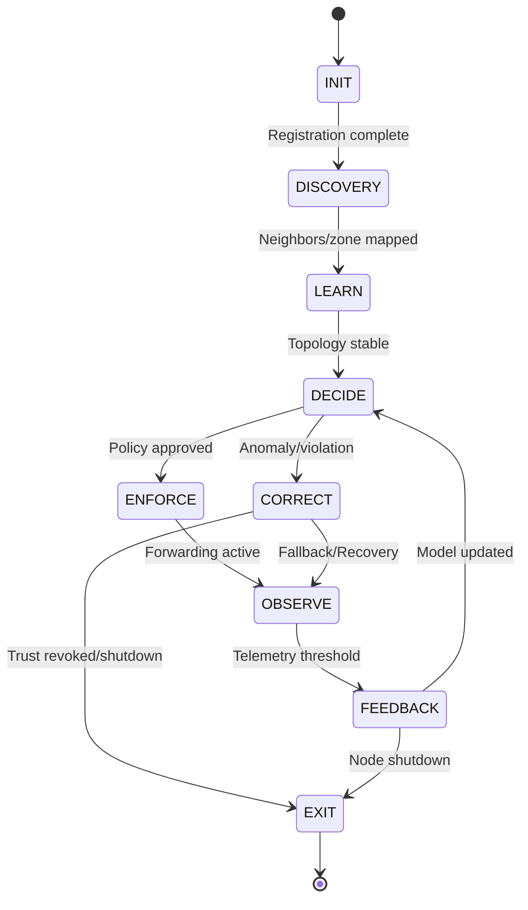

# ATROP FSM (Finite State Machine) Architecture

## Overview

The ATROP protocol leverages a modular Finite State Machine (FSM) at the heart of its control plane to orchestrate autonomous, intent-driven routing and adaptive network behavior. The FSM is implemented in C++ for performance and extensibility, with planned Python integration for AI/ML and telemetry feedback.

---

## FSM Architecture

The FSM engine manages the lifecycle and transitions of ATROP protocol states. Each state encapsulates a distinct phase of the protocol, handling specific responsibilities and events. The FSM is designed for:

- **Extensibility:** New states and transitions can be added with minimal changes.
- **Observability:** Integrated logging and configuration for traceability.
- **Separation of Concerns:** Each state is a self-contained class, promoting modularity and testability.

### Core States

| State      | Responsibility                                                                 |
|------------|-------------------------------------------------------------------------------|
| INIT       | Node bootstrapping, identity generation, and initial configuration.            |
| DISCOVERY  | Neighbor and zone boundary discovery, trust validation.                        |
| LEARN      | Topology modeling, AI/ML data collection, and flow analysis.                   |
| DECIDE     | Route decision-making based on AI policies and predictive models.              |
| ENFORCE    | Path enforcement, policy application, and forwarding activation.               |
| OBSERVE    | Telemetry collection, PIV/FIF updates, and observation feedback.               |
| FEEDBACK   | Model retraining, weight adjustment, and feedback loop closure.                |
| CORRECT    | Anomaly detection, correction packet handling, and fallback logic.             |
| EXIT       | Graceful shutdown, state export, and secure leave from the topology.           |

---

## State Transition Diagram & Event Flow



**Event Triggers:**
- Registration, neighbor discovery, topology stability, policy approval, telemetry thresholds, anomaly detection, shutdown signals.

---

## Example Usage

### Instantiating and Running the FSM Engine

```cpp
#include "fsm_engine.hpp"
#include "states/init_state.hpp"
// ... other state includes

auto logger = atrop::Logger::get();
FSMEngine fsm(logger);

fsm.register_state("INIT", std::make_shared<InitState>(logger));
fsm.register_state("DISCOVERY", std::make_shared<DiscoveryState>(logger));
// ... register other states

fsm.start("INIT");

// Transition example
fsm.transition_to("DISCOVERY");
```

### Extension Points

- **Add a New State:**  
  1. Implement a new state class inheriting from `BaseState`.
  2. Register the new state with the FSM engine.
  3. Define transition logic in the FSM or state classes.

- **Custom Event Handling:**  
  Override event methods in state classes to handle protocol-specific triggers.

---

## Logger and Config Integration

- **Logger:**  
  All FSM components receive a logger instance for structured, context-rich logging.  
  Example:  
  ```cpp
  log->info("Transitioning to state: {}", state_name);
  ```

- **Config Loader:**  
  Configuration is loaded once at startup and can be passed to FSM components as needed.  
  Example:  
  ```cpp
  auto config = ConfigLoader::load("config.yaml");
  ```

- **Best Practice:**  
  Pass only relevant config values to each state to maintain encapsulation.

---

## Plan for Python/C++ Integration

- **Current:**  
  FSM and states are implemented in C++ for performance and system integration.

- **Planned Integration:**  
  - Use [pybind11](https://github.com/pybind/pybind11) or [gRPC](https://grpc.io/) for Python bindings.
  - Enable AI/ML modules (Python) to trigger FSM transitions or receive telemetry.
  - Support hybrid event loops and shared memory or IPC for fast data exchange.

- **Extension Example:**  
  - Python ML agent signals anomaly → C++ FSM transitions to CORRECT state.
  - C++ FSM emits telemetry → Python module consumes for model retraining.

*For further details, see the main project [README.md](../README.md) and protocol documentation.*

---

# ATROP FSM Engine

This directory contains the implementation of the ATROP protocol's Finite State Machine (FSM) engine and all core state logic for the control plane.

## Overview

The FSM engine manages the lifecycle and transitions of ATROP control plane nodes, supporting the following states:

- INIT
- DISCOVERY
- LEARN
- DECIDE
- ENFORCE
- OBSERVE
- FEEDBACK
- CORRECT
- EXIT

Transitions between these states are event-driven and governed by protocol logic, AI/ML triggers, and configuration parameters.

## Structure

- `fsm_engine.cpp` / `fsm_engine.hpp`: FSM engine core logic, event handling, and transition enforcement.
- `base_state.cpp` / `base_state.hpp`: Abstract base class for all FSM states.
- `states/`: Directory containing implementation files for each FSM state:
  - `init_state.cpp`, `discovery_state.cpp`, `learn_state.cpp`, `decide_state.cpp`, `enforce_state.cpp`, `observe_state.cpp`, `feedback_state.cpp`, `correct_state.cpp`, `exit_state.cpp`

## Transition Logic

- All allowed transitions, triggers, and event sources are documented in [docs/fsm/transitions.md](../../../docs/fsm/transitions.md).
- The FSM diagram is available at [docs/diagrams/fsm.png](../../../docs/diagrams/fsm.png).

## Invalid Transition Handling

- The FSM engine blocks all invalid transitions.
- All invalid transition attempts are logged as errors, including the current state, event, and reason for the block.

## Configuration

- Event triggers and thresholds are configurable via the central config loader.
- See [sdk/c++/config_loader.hpp](../../../sdk/c++/config_loader.hpp) and your config files for details.

## References

- [FSM Transitions Documentation](../../../docs/fsm/transitions.md)
- [FSM Diagram](../../../docs/diagrams/fsm.png)
- [Config Loader](../../../sdk/c++/config_loader.hpp)
- [Logger](../../../daemon/common/logger.hpp)

---

_Last updated: 2025-07-04_

---

**Source:**  
- [FSM Engine](https://github.com/Mahmoudtawfeekie2024/atrop-protocol/tree/main/daemon/control_plane/fsm)  
- [FSM Transitions](https://github.com/Mahmoudtawfeekie2024/atrop-protocol/blob/main/docs/fsm/transitions.md)
