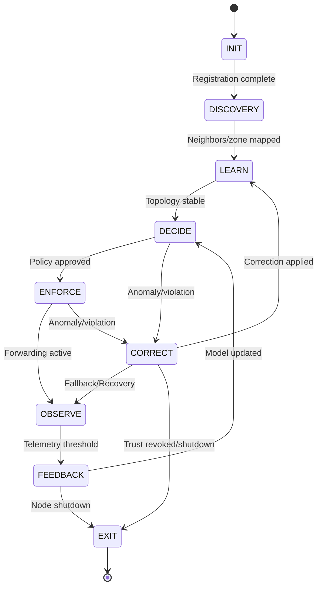

# ATROP FSM State Transitions

This document defines all valid state transitions, event triggers, and implementation notes for the ATROP protocol control plane FSM.

---

## 1. State Transition Table

| From State  | To State     | Event/Trigger                | Description                                                                 |
|-------------|-------------|------------------------------|-----------------------------------------------------------------------------|
| INIT        | DISCOVERY    | Registration complete        | Node boots, identity validated, initial config loaded                       |
| DISCOVERY   | LEARN        | Neighbors/zone mapped        | Adjacency formed, ATZ boundary mapped, trust established                    |
| LEARN       | DECIDE       | Topology stable              | Sufficient topology/telemetry data, AI/ML model ready                       |
| DECIDE      | ENFORCE      | Policy approved              | AI decision confidence above threshold, intent/policy match                  |
| ENFORCE     | OBSERVE      | Forwarding active            | Policy enforced, data plane operational, flows being forwarded               |
| OBSERVE     | FEEDBACK     | Telemetry threshold reached  | Sufficient telemetry/feedback collected (FIF/PIV), ready for model update    |
| FEEDBACK    | DECIDE       | Model updated                | Model retrained, confidence sufficient, ready for new decision               |
| DECIDE      | CORRECT      | Anomaly/SLA violation        | Detected by AI/ML or policy engine (e.g., SLA breach, intent deviation)      |
| ENFORCE     | CORRECT      | Anomaly/SLA violation        | Detected by AI/ML or policy engine (e.g., SLA breach, intent deviation)      |
| CORRECT     | OBSERVE      | Fallback/Recovery            | Correction applied, fallback intent/routing in place, resume observation     |
| CORRECT     | LEARN        | Correction applied           | Correction complete, re-enter learning to update model                       |
| CORRECT     | EXIT         | Trust revoked/shutdown       | Fatal error, security event, or admin shutdown                               |
| FEEDBACK    | EXIT         | Node shutdown                | Admin or policy shutdown, graceful exit                                      |
| ANY         | CORRECT      | Anomaly/Manual override      | Emergency override, critical anomaly, or manual intervention                 |
| ANY         | INIT         | Manual reset                 | Admin or system reset, re-initialization                                     |
| EXIT        | [*]          | -                            | End of lifecycle                                                            |

---

## 2. FSM Flowchart



---

## 3. Event/Trigger Breakdown

| Event/Trigger                | Description                                                                 | Typical Source                | Type                        |
|------------------------------|-----------------------------------------------------------------------------|-------------------------------|-----------------------------|
| Registration complete        | Node boots, identity validated, config loaded                               | System/Init handler           | Internal                    |
| Neighbors/zone mapped        | Adjacency formed, ATZ boundary mapped, trust established                    | Discovery handler, network    | External                    |
| Topology stable              | Sufficient topology/telemetry data, AI/ML model ready                       | Learning/AI engine            | Internal                    |
| Policy approved              | AI decision confidence above threshold, intent/policy match                  | AI/ML engine                  | Internal, Config-driven     |
| Forwarding active            | Policy enforced, data plane operational, flows being forwarded               | Data plane/Enforcement handler| Internal                    |
| Telemetry threshold reached  | Sufficient telemetry/feedback collected (FIF/PIV), ready for model update    | Observation handler           | Internal, Config-driven     |
| Model updated                | Model retrained, confidence sufficient, ready for new decision               | Feedback handler/AI engine    | Internal                    |
| Anomaly/SLA violation        | Detected by AI/ML or policy engine (e.g., SLA breach, intent deviation)      | AI/ML engine, Security handler| Internal, Config-driven     |
| Fallback/Recovery            | Correction applied, fallback intent/routing in place, resume observation     | Correction handler            | Internal                    |
| Correction applied           | Correction complete, ready to re-learn                                       | Correction handler            | Internal                    |
| Trust revoked/shutdown       | Fatal error, security event, or admin shutdown                               | Security handler/Admin        | External                    |
| Node shutdown                | Admin or policy shutdown, graceful exit                                      | Admin/Policy                  | External                    |
| Anomaly/Manual override      | Emergency override, critical anomaly, or manual intervention                 | Admin/AI/ML engine            | External                    |
| Manual reset                 | Admin or system reset, re-initialization                                     | Admin/System                  | External                    |

### Legend

- **Internal:** Generated by the FSM engine or its submodules (e.g., state logic, AI/ML, correction handler).
- **External:** Originates outside the FSM (e.g., network events, admin commands, external daemons).
- **Config-driven:** The event is triggered when a configurable threshold or condition is met (e.g., telemetry threshold, AI confidence).

#### Example Usage

- **Config-driven events** (e.g., "Telemetry threshold reached", "Policy approved", "Anomaly/SLA violation") should reference the config loader for their thresholds or conditions.
- **External events** (e.g., "Neighbors/zone mapped", "Node shutdown", "Manual reset") are typically received via IPC, network messages, or admin commands.
- **Internal events** are handled within the FSM and do not require external input.

---

## 4. Per-State Event Handler Stubs

Below are suggested event handler stubs for each state, to be implemented in the corresponding state class:

### INIT State
- on_enter: Validate identity, load config
- on_event: Registration complete → DISCOVERY
- on_event: Manual reset → INIT

### DISCOVERY State
- on_enter: Start neighbor/zone discovery
- on_event: Neighbors/zone mapped → LEARN
- on_event: Anomaly/Manual override → CORRECT

### LEARN State
- on_enter: Start topology/telemetry collection, AI/ML model training
- on_event: Topology stable → DECIDE
- on_event: Anomaly/Manual override → CORRECT

### DECIDE State
- on_enter: Run AI/ML decision logic
- on_event: Policy approved → ENFORCE
- on_event: Anomaly/SLA violation → CORRECT

### ENFORCE State
- on_enter: Apply policy, activate data plane
- on_event: Forwarding active → OBSERVE
- on_event: Anomaly/SLA violation → CORRECT

### OBSERVE State
- on_enter: Collect telemetry (FIF/PIV)
- on_event: Telemetry threshold reached → FEEDBACK
- on_event: Anomaly/Manual override → CORRECT

### FEEDBACK State
- on_enter: Retrain/update model, process feedback
- on_event: Model updated → DECIDE
- on_event: Node shutdown → EXIT

### CORRECT State
- on_enter: Apply correction, fallback, or isolation
- on_event: Fallback/Recovery → OBSERVE
- on_event: Correction applied → LEARN
- on_event: Trust revoked/shutdown → EXIT

### EXIT State
- on_enter: Cleanup, export state, shutdown

---

## 5. Handling Invalid Transitions

### Policy

- The FSM engine must strictly enforce the valid transitions as defined in the transition table.
- Any attempted transition not explicitly listed as valid is considered invalid.

### Actions on Invalid Transition

1. **Logging**
   - All invalid transition attempts must be logged using the central logger.
   - The log entry should include:
     - The current state
     - The attempted target state
     - The triggering event (if available)
     - Timestamp and node identity
     - Contextual information (e.g., event payload, config snapshot if relevant)
   - Log level: `ERROR` (or `WARNING` if the transition is recoverable)

2. **Error Handling**
   - The FSM should reject the invalid transition and remain in the current state.
   - If the invalid transition was triggered by an external event (e.g., admin command, IPC), an error response should be sent back to the source if possible.
   - If the invalid transition is due to a software bug or internal inconsistency, the FSM may:
     - Attempt a safe fallback (e.g., transition to a known safe state like `CORRECT` or `INIT`)
     - Raise an exception or error code for higher-level handling
     - Optionally trigger a self-healing or reset routine if configured

3. **Metrics and Telemetry**
   - Increment a counter for invalid transitions (for monitoring and audit).
   - Optionally export invalid transition events to the telemetry/logging pipeline for further analysis.

#### Example Log Entry

```
[ERROR] [FSM] Invalid transition attempted: State=ENFORCE, Target=LEARN, Event=TopologyStable, NodeID=ATROP-123, Timestamp=2024-06-10T12:34:56Z, Context={...}
```

#### Implementation Notes

- The FSM engine implementation (see `fsm_engine.hpp`/`.cpp`) should centralize this logic in the transition handler.
- Unit and integration tests should cover invalid transition scenarios to ensure robust error handling and logging.

---

## 6. Implementation Notes

- All transitions should be logged via the logger.
- Invalid transitions must be blocked and logged as errors.
- Triggers such as telemetry thresholds and AI confidence are configurable via the config loader.
- Emergency/manual transitions (ANY → CORRECT/INIT) must be supported for resilience.

---

## 7. References

- FSM Engine: `daemon/control_plane/fsm/fsm_engine.hpp`, `fsm_engine.cpp`
- State Implementations: `daemon/control_plane/fsm/states/`
- Logger: `daemon/common/logger.hpp`
- Config Loader: `sdk/c++/config_loader.hpp`
- FSM Diagram: `docs/diagrams/fsm.png`

---

_Last updated: 2024-07-04_
Source: [Repo structure and code files](https://github.com/Mahmoudtawfeekie2024/atrop-protocol)
