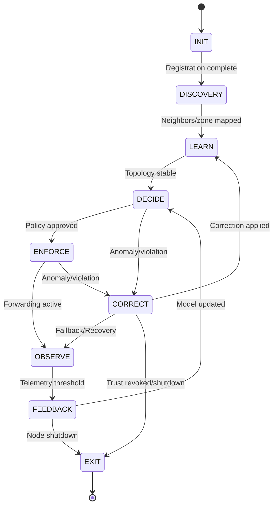

# ATROP FSM State Transitions

This document describes the finite state machine (FSM) transitions for the ATROP protocol control plane. It defines all valid states, transition events, and the logic governing state changes, as implemented in the FSM engine.

---

## 1. State Transition Table

| From State  | Event/Trigger                | To State     | Description                                         |
|-------------|-----------------------------|--------------|-----------------------------------------------------|
| INIT        | Registration complete       | DISCOVERY    | Node boots, identity validated                      |
| DISCOVERY   | Neighbors/zone mapped       | LEARN        | Adjacency/zone discovery successful                 |
| LEARN       | Topology stable             | DECIDE       | AI/ML model ready, sufficient data                  |
| DECIDE      | Policy approved             | ENFORCE      | AI decision confidence threshold met                |
| ENFORCE     | Forwarding active           | OBSERVE      | Policy enforced, data plane ready                   |
| OBSERVE     | Telemetry threshold reached | FEEDBACK     | Sufficient telemetry/feedback collected             |
| FEEDBACK    | Model updated               | DECIDE       | Model retrained, confidence sufficient              |
| DECIDE      | Anomaly/SLA violation       | CORRECT      | Detected by AI/ML or policy engine                  |
| ENFORCE     | Anomaly/SLA violation       | CORRECT      | Detected by AI/ML or policy engine                  |
| FEEDBACK    | Node shutdown               | EXIT         | Admin or policy shutdown                            |
| CORRECT     | Fallback/Recovery           | OBSERVE      | Correction applied, resume observation              |
| CORRECT     | Trust revoked/shutdown      | EXIT         | Fatal error, security event, or admin shutdown      |
| CORRECT     | Correction applied          | LEARN        | Re-enter learning after correction                  |
| ANY         | Anomaly/Manual Reset        | CORRECT/INIT | Emergency override, admin or AI/ML trigger          |
| EXIT        | -                           | [*]          | End of lifecycle                                    |

**Notes:**
- `CORRECT` can be triggered from any state on anomaly or policy violation.
- `FEEDBACK` can loop into `DECIDE` if model confidence is sufficient.
- `INIT` can be re-entered on daemon crash or reset.

---

## 2. FSM Flowchart

---

## 3. Event Triggers

| Event Type         | Source             | Triggered State |
|--------------------|--------------------|-----------------|
| Adjacency Up       | Protocol Neighbor  | DISCOVERY       |
| Zone Join Complete | FSM                | LEARN           |
| AI Decision Ready  | Control Plane      | DECIDE          |
| Policy Match       | AI Intent Engine   | ENFORCE         |
| FIF Received       | ML Data Plane      | FEEDBACK        |
| Anomaly Detected   | AI/ML              | CORRECT         |
| Manual Reset       | Admin/Policy       | INIT            |

---

## 4. Transition Logic Notes

- **Invalid Transitions:**  
  Any transition not listed above should be blocked and logged as an error or warning by the FSM engine.
- **Emergency Override:**  
  The FSM supports emergency transitions (e.g., to `CORRECT` or `INIT`) on critical anomaly or manual intervention.
- **Configurable Triggers:**  
  Some transitions (e.g., thresholds for telemetry, AI confidence) are configurable via the central config loader.

---

## 5. References

- FSM Engine: `daemon/control_plane/fsm/fsm_engine.hpp`, `fsm_engine.cpp`
- State Implementations: `daemon/control_plane/fsm/states/`
- Logger: `daemon/common/logger.hpp`
- Config Loader: `sdk/c++/config_loader.hpp`
- FSM Diagram: `docs/diagrams/fsm.png`

---

_Last updated: 2025-07-04_
